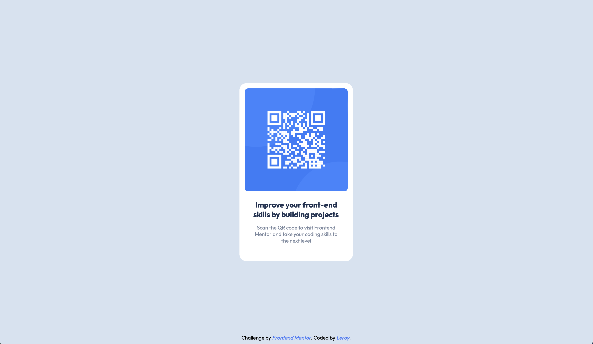

# Frontend Mentor - QR code component solution

This is a solution to the [QR code component challenge on Frontend Mentor](https://www.frontendmentor.io/challenges/qr-code-component-iux_sIO_H). Frontend Mentor challenges help you improve your coding skills by building realistic projects. 

## Table of contents

- [Overview](#overview)
  - [Screenshot](#screenshot)
  - [Links](#links)
- [My process](#my-process)
  - [Built with](#built-with)
  - [What I learned](#what-i-learned)
  - [Continued development](#continued-development)
- [Author](#author)

## Overview

### Screenshot

### Links

- Solution URL: (https://qr-frontendmentor.web.app)

## My process

### Built with

- Semantic HTML5 markup
- CSS custom properties
- Flexbox

### What I learned

I have practiced CSS Flexbox and basic CSS styling. I've explored the art of creating flexible web layouts that adapt beautifully to different devices. 

### Continued development

I want to get deeper into CSS Flexbox and in the future, learn preprocessed CSS such as Sass or LESS to implement new projects.

## Author

- Nickname - leroy
- Frontend Mentor - [@pausm99](https://www.frontendmentor.io/profile/pausm99)