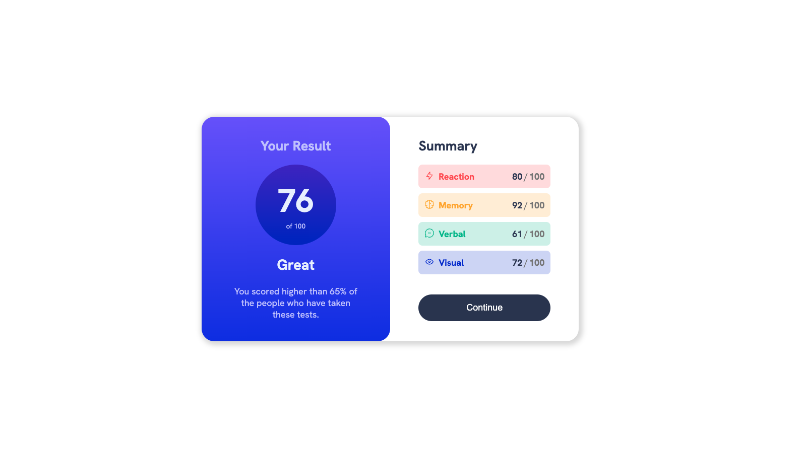
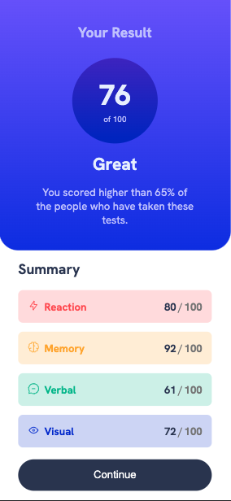

# Frontend Mentor - Results summary component solution

This is a solution to the [Results summary component challenge on Frontend Mentor](https://www.frontendmentor.io/challenges/results-summary-component-CE_K6s0maV). Frontend Mentor challenges help you improve your coding skills by building realistic projects. 

## Table of contents

- [Overview](#overview)
  - [The challenge](#the-challenge)
  - [Screenshots](#screenshots)
  - [Links](#links)
- [My process](#my-process)
  - [Built with](#built-with)
  - [What I learned](#what-i-learned)
  - [Continued development](#continued-development)
- [Author](#author)

## Overview

### The challenge

Users should be able to:

- View the optimal layout for the interface depending on their device's screen size
- See few interactive elements

### Screenshots
Desktop screenshot

Mobile screenshot

Mobile screenshot (landscape)

### Links

- Solution URL: [Solution](https://results-summary.web.app/)

## My process

### Built with

- Semantic HTML5 markup
- CSS custom properties
- Flexbox
- CSS Grid

### What I learned

I've learned to combine containers using both Flexbox and CSS Grid. I also practiced with HSL colors as I had only worked with RGB so far. 

### Continued development

I want to get deeper into CSS Flexbox and in the future, learn preprocessed CSS such as Sass or LESS to implement new projects.

## Author

- Nickname - leroy
- Frontend Mentor - [@pausm99](https://www.frontendmentor.io/profile/pausm99)
